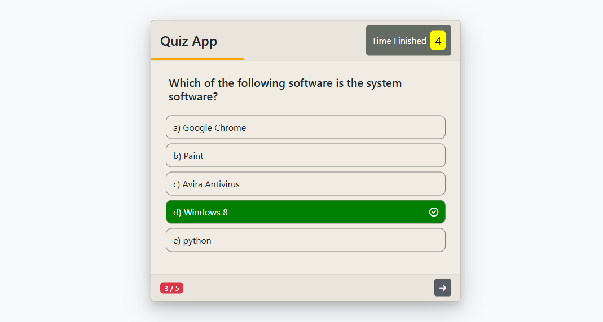
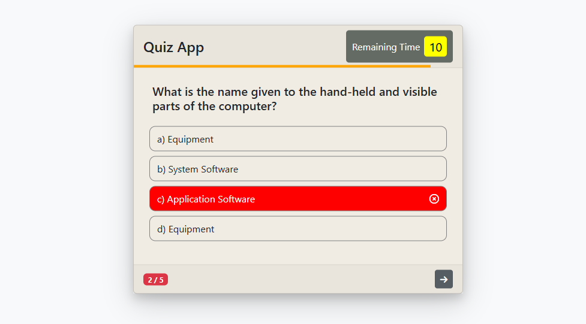
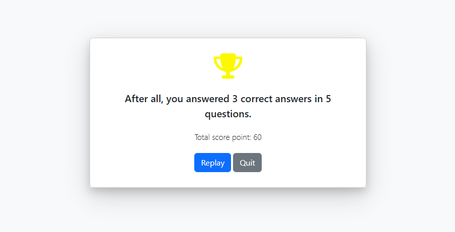

<h1 style="font-size:30px;text-align:center;color:green">QUIZ APP</h1>

In this project, we have developed a quiz application on the web with javascript.

<h3 style="font-size:15px;color:red">Web Lınk</h3>
<a href="https://quizesa.netlify.app/">Click on the link</a>

<h3 style="font-size:15px;color:yellow">QUIZ LIST APP</h3>

##### I have developed a dynamic quiz application. By defining the number of questions and question options requested by the person who will conduct the quiz, it is possible to access information about how much score the person who will be quizzed will get.

<h3 style="font-size:15px;color:yellow">1.1- App Working Logic</h3>

###### The quiz is displayed with the start button with sorry.
###### According to the user's selected option, green for the correct option appears in the options with red for the wrong option.
###### As a result of clicking or expiration, the switch button appears.
###### When the result screen is displayed, the score information is displayed on the screen considering how many questions he answered correctly and the equal score of each question.
###### As a result of the restart, the user is directed to the first question.
###### The quiz exit result redirects the user to the start button page.

 <h3 style="font-size:15px;color:yellow">1.2-QuizApp Images</h3>

    
    
    

 <h3 style="font-size:15px;color:yellow">1.3-Sections that can be improved</h3>

###### A question and answer form can be created for the quiz and a question addition section can be created.

###### With the form created, different duration and points can be defined for each question.